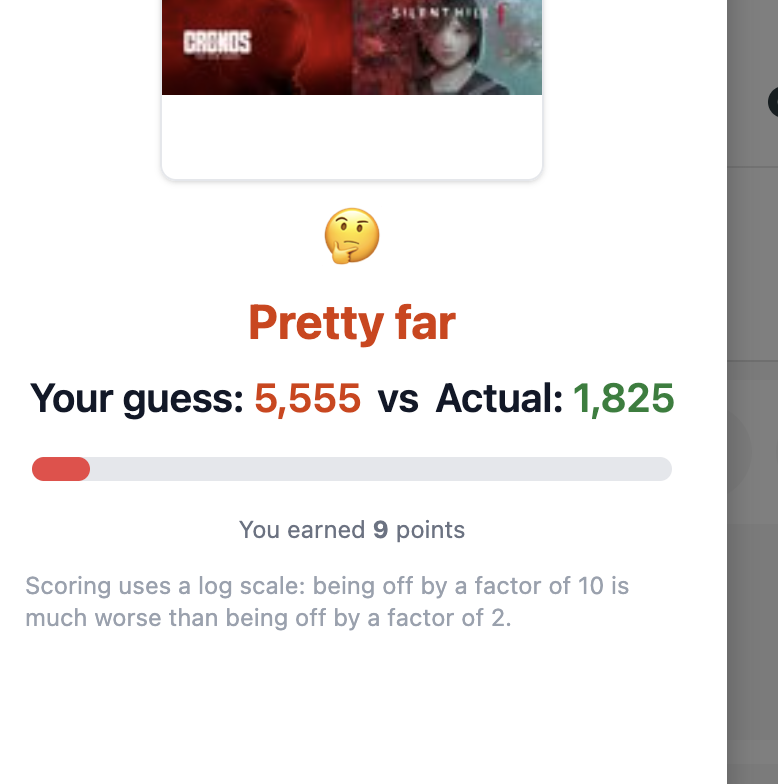
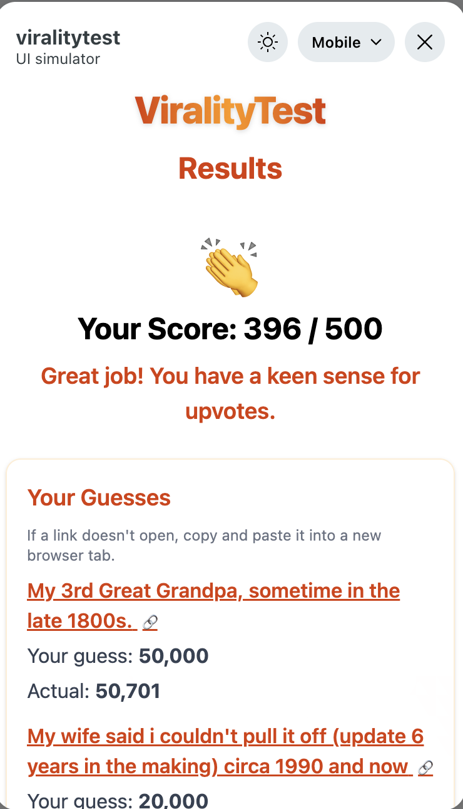

    

🔥 ViralityTest
---

Play it here: https://www.reddit.com/r/viralitytest_dev/?playtest=viralitytest

### Screenshots

	<h3>Home Page</h3>
	
	
<em>Start your quiz by picking a subreddit or entering your own.</em>

	<h3>Questions Dynamically Generated</h3>
	
	
<em>Each quiz pulls live posts from Reddit for a fresh experience.</em>

	<h3>Feedback After Each Question</h3>
	
	
<em>See how close your guess was and get instant feedback.</em>

	<h3>Result Page</h3>
	
	
<em>Review your final score and see your performance.</em>

	<h3>ViralityTest Logo</h3>
	
	
<em>Branding for the ViralityTest app.</em>

A starter to build web applications on Reddit's developer platform

- [Devvit](https://developers.reddit.com/): A way to build and deploy immersive games on Reddit
- [Vite](https://vite.dev/): For compiling the webView
- [React](https://react.dev/): For UI
- [Express](https://expressjs.com/): For backend logic
- [Tailwind](https://tailwindcss.com/): For styles
- [Typescript](https://www.typescriptlang.org/): For type safety

## Getting Started

> Make sure you have Node 22 downloaded on your machine before running!

1. Run `npm create devvit@latest --template=react`
2. Go through the installation wizard. You will need to create a Reddit account and connect it to Reddit developers
3. Copy the command on the success page into your terminal

## Commands

- `npm run dev`: Starts a development server where you can develop your application live on Reddit.
- `npm run build`: Builds your client and server projects
- `npm run deploy`: Uploads a new version of your app
- `npm run launch`: Publishes your app for review
- `npm run login`: Logs your CLI into Reddit
- `npm run check`: Type checks, lints, and prettifies your app

## Cursor Integration

This template comes with a pre-configured cursor environment. To get started, [download cursor](https://www.cursor.com/downloads) and enable the `devvit-mcp` when prompted.
